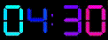

# Corna

A minimal Wayland layer-shell widget for the desktop corner. Features a seven-segment clock display and pomodoro timer with psychedelic completion animations.



## Overview

Corna is a lightweight desktop widget written in Rust that sits in your screen's top-right corner. It provides:

- **Seven-segment digital clock** with 11 color themes
- **Pomodoro timer** with multiple duration presets (5-30 minutes)
- **Radical plasma animations** on timer completion
- **Minimal resource usage** - pure Wayland + OpenGL ES 2.0, no heavy GUI frameworks

The widget responds to mouse clicks and scroll wheel for interaction.

## Requirements

- Wayland compositor with layer-shell support (Sway, Hyprland, etc.)
- OpenGL ES 2.0 support
- Rust toolchain (1.70+)

## Installation

### From Source

```bash
# Clone the repository
git clone https://github.com/zackham/corna.git
cd corna

# Build release version
cargo build --release

# Run directly
cargo run --release

# Or install to ~/.cargo/bin
cargo install --path .
```

### Dependencies

The following system libraries are required:
- `wayland-client`
- `wayland-egl`
- `EGL`
- `GL`

On most distributions these can be installed via:

```bash
# Debian/Ubuntu
sudo apt install libwayland-dev libegl1-mesa-dev libgles2-mesa-dev

# Fedora
sudo dnf install wayland-devel mesa-libEGL-devel mesa-libGLES-devel

# Arch
sudo pacman -S wayland mesa
```

## Usage

### Running

Start corna in the background:
```bash
corna &
```

Or use the included restart script during development:
```bash
./restart.sh  # Rebuilds and restarts in background
```

### Controls

**Main Widget (Clock)**
- **Left click**: Toggle seconds display on/off
- **Right click**: Start/stop pomodoro timer (creates timer window when started)
- **Scroll wheel on clock**: Cycle through 11 different color themes

**Pomodoro Timer** (appears as separate 80x30 window when active)
- **Scroll wheel on timer**: Cycle through timer durations (30, 25, 20, 15, 10, 5 minutes)
- Timer automatically starts counting when created via right-click
- Right-click again on main widget to stop timer

### Configuration

Configuration file is located at `~/.config/corna/config.toml`

Example configuration:
```toml
[position]
anchor = "TopRight"
exclusive_zone = 0

[margins]
top = 0
right = 0
bottom = 0
left = 0

[collapsed_size]
width = 150
height = 60

[expanded_size]
width = 220
height = 60

[theme]
background = "#1a1a1a"
foreground = "#ffffff"
accent = "#4a9eff"

fps_cap = 60
animations_enabled = true
```

## Building

```bash
# Development build with debug symbols
cargo build

# Optimized release build
cargo build --release

# Run tests
cargo test

# Format code
cargo fmt

# Run linter
cargo clippy
```

## Architecture

Corna is built with minimal dependencies:
- Direct Wayland protocol implementation (no GTK/Qt)
- OpenGL ES 2.0 for rendering (via glow)
- Custom immediate-mode drawing API
- Frame-perfect animations synced with compositor

## License

MIT License - See LICENSE file for details